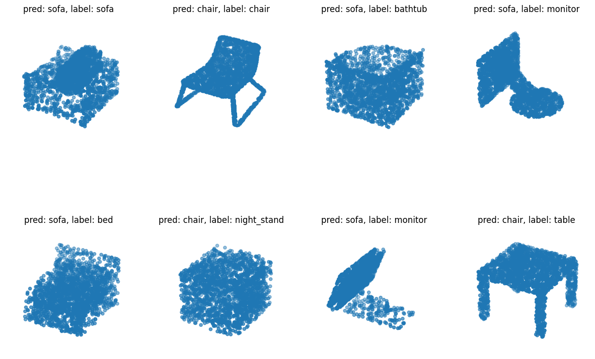

# Point Cloud Classification with Point Net

## 1. Project Summary

In this repository, we will implement the PointNet architecture for point clouds classification. This architecture was introduced in the paper titled <em>PointNet: Deep Learning on Point Sets for 3D Classification and Segmentation</em> by Charles R. Qi, et al at the Neural Information Processing Systems (NeurIPS) conference in 2016.

This project is for learning purposes. The code I used in this repository is heavily based on the post by Keras Team (David Griffiths) in this [notebook](https://colab.research.google.com/github/keras-team/keras-io/blob/master/examples/vision/ipynb/pointnet.ipynb#scrollTo=GqHrVYP5bQKn) and [web page](https://keras.io/examples/vision/pointnet/).

### 1.1. Dataset

We use the Princeton 3D Shapenets data of 10 classes (ModelNet10) which consists of daily objects such as chair, table, and plane. The link to the dataset can be found [here](https://3dshapenets.cs.princeton.edu/).

```plaintext
Dataset: 3D Shapenets (ModelNet10)
- Size: 4.9k samples
- Classes: 10
- Download Link: [3D Shapenets Dataset](https://3dshapenets.cs.princeton.edu/)
```

### 1.2. Architecture

PointNet is a neural network architecture designed for processing and analyzing point clouds. It employs a shared multi-layer perceptron (MLP) to process each point independently to capture local features. It also introduces a symmetric function to aggregate information from all points, ensuring the network is permutation-invariant, meaning it produces the same output regardless of the order of input points. Figure 1 displays the PointNet architecture diagram.

<p align="center">
  
</p>

PointNet is effective in recognizing and classifying objects in 3D space. It is used for tasks like segmentation and classification, as shown by Figure 2.

<p align="center">
  
</p>


## 2. Usage

### 2.1. Installation

1. First, you need to clone the repository:

    ```bash
    git clone https://github.com/arief25ramadhan/pointnet-classification.git
    cd pointnet-classification
    ```

2. Then, install dependencies:

    ```bash
    pip install -r requirements.txt
    ```

### 2.2. Download the Dataset

1. Visit this [link](https://3dshapenets.cs.princeton.edu/) to download the dataset, and press the download button of the ModelNet10.zip. 
2. Extract the downloaded zip file.
3. Define your dataset folder path in the dataset.py file.

### 2.3.Training

To train the model, run this command:

```bash
python train.py
```

### 2.4. Inference

Once you have the dataset and trained model, you can perform inference by running:

```bash
python inference.py
```

Make sure you define the model path and test path correctly.

### 2.5. Results

After training the model for 20 epochs, the models achieved an accuracy of 72% on the validation set. Note that this project is only for learning purposes. Creating the most accurate model, which requires a lot of tuning and training, is not our priority. Visually, the inference result of the model is shown by Figure 3 below. 

<p align="center">
  
</p>


## References

1. Qi, Charles R., et al. "Pointnet: Deep learning on point sets for 3d classification and segmentation." Proceedings of the IEEE Conference on Computer Vision and Pattern Recognition. 2017.

2. Original notebook by David Griffiths: https://colab.research.google.com/github/keras-team/keras-io/blob/master/examples/vision/ipynb/pointnet.ipynb#scrollTo=GqHrVYP5bQKn

3. Original tutorial by David Griffiths: https://keras.io/examples/vision/pointnet/